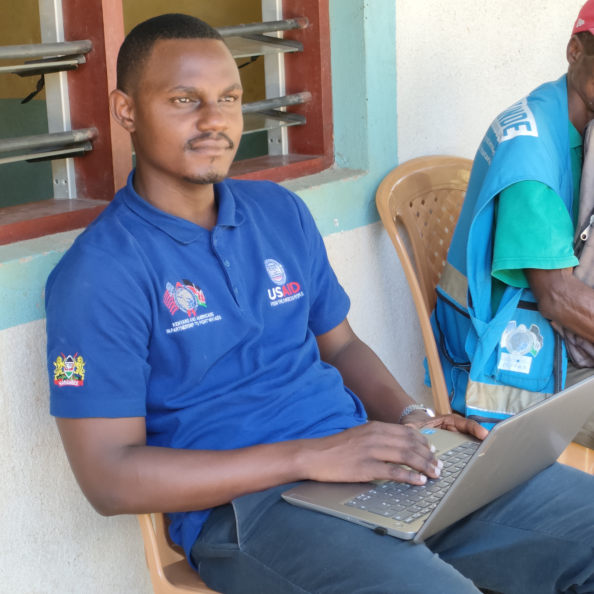

```{=html}
<style>
  /* Root Theme Configuration matching the topmate aesthetic */
  :root {
    --brand-orange: #d94d43;
    --text-light: #ffffff;
    --text-dark: #222222;
    --bg-cream: #f6f4ee;
    --card-shadow: 0 4px 15px rgba(0,0,0,0.05);
  }

  * {
    margin: 0;
    padding: 0;
    box-sizing: border-box;
  }

  body {
    font-family: system-ui, -apple-system, 'Segoe UI', Roboto, Helvetica, sans-serif;
    background: var(--bg-cream);
  }

  /* Core Layout splits 1/4 and 3/4 */
  .portfolio-container {
    display: grid;
    grid-template-columns: 1fr;
    min-height: 100vh;
  }

  @media (min-width: 992px) {
    .portfolio-container {
      grid-template-columns: 1.2fr 3.8fr;
    }
  }

  /* Left Panel: Core Profile Branding Sidebar */
  .profile-sidebar {
    background-color: var(--brand-orange);
    color: var(--text-light);
    padding: 3rem 2rem;
    display: flex;
    flex-direction: column;
    align-items: center;
    text-align: center;
  }

  .avatar-frame {
    width: 160px;
    height: 160px;
    border-radius: 50%;
    overflow: hidden;
    margin-bottom: 1.5rem;
    border: 3px solid rgba(255, 255, 255, 0.4);
    box-shadow: 0 4px 10px rgba(0,0,0,0.15);
  }

  .avatar-frame img {
    width: 100%;
    height: 100%;
    object-fit: cover;
  }

  .profile-sidebar h1 {
    font-size: 2rem;
    font-weight: 700;
    margin-bottom: 0.5rem;
    color: var(--text-light);
    line-height: 1.2;
  }

  .profile-sidebar h4 {
    font-size: 1rem;
    font-weight: 400;
    opacity: 0.9;
    margin-bottom: 1.5rem;
    line-height: 1.4;
    width: 100%;
  }

  /* Social Links */
  .sidebar-socials {
    display: flex;
    gap: 1.5rem;
    font-size: 1.5rem;
  }

  .sidebar-socials a {
    color: var(--text-light);
    opacity: 0.85;
    transition: opacity 0.2s, transform 0.2s;
  }

  .sidebar-socials a:hover {
    opacity: 1;
    transform: scale(1.1);
  }

  /* Right Panel: Main Dashboard Content Area */
  .content-showcase {
    background-color: var(--bg-cream);
    padding: 4rem 3rem;
    color: var(--text-dark);
  }

  @media (max-width: 768px) {
    .content-showcase {
      padding: 2rem 1.5rem;
    }
  }

  /* Horizontal Content-Top Navigation Menu */
  .sidebar-nav {
    display: flex;
    flex-wrap: wrap;
    gap: 0.75rem;
    margin-bottom: 2.5rem;
    padding-bottom: 1.5rem;
    border-bottom: 1px solid rgba(0, 0, 0, 0.08);
  }

  .sidebar-nav a {
    color: #555555;
    text-decoration: none;
    font-size: 14px;
    font-weight: 500;
    padding: 10px 20px;
    border-radius: 30px;
    background: #ffffff;
    box-shadow: 0 2px 8px rgba(0,0,0,0.02);
    border: 1px solid rgba(0, 0, 0, 0.05);
    transition: all 0.2s ease;
    display: inline-flex;
    align-items: center;
    gap: 0.5rem;
  }

  .sidebar-nav a:hover {
    color: var(--brand-orange);
    background: #ffffff;
    border-color: var(--brand-orange);
    transform: translateY(-1px);
  }

  .sidebar-nav a.active {
    color: #ffffff;
    background: var(--brand-orange);
    border-color: var(--brand-orange);
    font-weight: 600;
    box-shadow: 0 4px 12px rgba(217, 77, 67, 0.25);
  }

  .showcase-section-title {
    font-size: 1.6rem;
    font-weight: 700;
    color: var(--text-dark);
    margin-bottom: 1rem;
  }

  .showcase-subtitle {
    color: #555555;
    font-size: 15px;
    line-height: 1.6;
    margin-bottom: 1rem;
  }

  .showcase-list {
    margin-bottom: 2.5rem;
    padding-left: 1.25rem;
  }

  .showcase-list li {
    font-size: 14px;
    color: #444444;
    margin-bottom: 0.5rem;
    line-height: 1.5;
  }

  /* Enhanced Content Cards styling for Dashboards section */
  .dashboard-container-card {
    background: #ffffff;
    border-radius: 16px;
    padding: 2.5rem;
    box-shadow: var(--card-shadow);
    border: 1px solid rgba(0,0,0,0.02);
    margin-bottom: 3rem;
  }

  .dashboard-container-card h2 {
    font-size: 1.4rem;
    color: var(--text-dark);
    margin-top: 0;
    margin-bottom: 1.25rem;
    display: flex;
    align-items: center;
    gap: 0.5rem;
  }

  .dashboard-meta-title {
    font-size: 13px;
    text-transform: uppercase;
    letter-spacing: 0.5px;
    font-weight: 600;
    color: var(--brand-orange);
    margin-bottom: 0.5rem;
    margin-top: 1.5rem;
  }

  .dashboard-container-card p {
    color: #444444;
    font-size: 14px;
    line-height: 1.6;
    margin-bottom: 1rem;
  }

  .metrics-list {
    list-style: none;
    padding-left: 0;
    margin-bottom: 1rem;
  }

  .metrics-list li {
    font-size: 14px;
    font-weight: 500;
    color: #222222;
    margin-bottom: 0.5rem;
    display: flex;
    align-items: center;
    gap: 0.5rem;
  }

  .img-gallery-grid {
    display: grid;
    grid-template-columns: repeat(auto-fit, minmax(280px, 1fr));
    gap: 1.5rem;
    margin-bottom: 1.5rem;
  }

  .img-gallery-grid img {
    width: 100%;
    height: auto;
    border-radius: 12px;
    border: 1px solid #e0e0e0;
    box-shadow: 0 2px 8px rgba(0,0,0,0.04);
  }

  hr {
    margin: 2.5rem 0;
    border: none;
    border-top: 1px solid rgba(0,0,0,0.1);
  }
</style>
```


```{=html}
<div class="portfolio-container">
  <!-- Left Panel Sidebar - Only Pic, Name, Title, Socials -->
  <div class="profile-sidebar">
    <div class="avatar-frame">
      
    </div>
    
    <h1>Roy Mwavita</h1>
    <h4>Research Data Analyst • Monitoring & Evaluation Specialist</h4>
    
    <div class="sidebar-socials">
      <a href="https://github.com/roy-mwavita0" target="_blank"><i class="fab fa-github"></i></a>
      <a href="https://www.linkedin.com/in/roy-mwavita-495b50220/" target="_blank"><i class="fab fa-linkedin"></i></a>
      <a href="mailto:lennicroy@gmail.com"><i class="fas fa-envelope"></i></a>
    </div>
  </div>

  <!-- Right Panel Content Showcase -->
  <div class="content-showcase">
    <!-- Navigation Menu Block -->
    <nav class="sidebar-nav">
      <a href="index.qmd"><i class="fas fa-home"></i> Home</a>
      <a href="projects.qmd"><i class="fas fa-project-diagram"></i> Projects</a>
      <a href="dashboards.qmd" class="active"><i class="fas fa-chart-pie"></i> Dashboards</a>
      <a href="digest.qmd"><i class="fas fa-book-open"></i> R Toolkit Digest</a>
      <a href="newsletter.qmd"><i class="fas fa-paper-plane"></i> Newsletter</a>
    </nav>

    <div class="showcase-section-title">Interactive Dashboards</div>
    <p class="showcase-subtitle">
      Over time, I have developed several interactive dashboards using <strong>R (Shiny, bslib, tidyverse, ggplot2, and highcharter)</strong> to support Monitoring, Evaluation, Accountability, and Learning (MEAL) functions.
    </p>
    <p class="showcase-subtitle">
      These dashboards transform raw program data into interactive insights that support:
    </p>
    <ul class="showcase-list">
      <li>Real-time decision-making</li>
      <li>Case management tracking</li>
      <li>Data quality and performance monitoring</li>
      <li>Operational reporting and learning</li>
    </ul>

    <hr>

    <!-- Dashboard Section 1: OVC -->
    <div class="dashboard-container-card">
      <h2>📊 OVC Program Dashboard</h2>
    
      <p style="font-weight: 600; color: #cc0000; margin-bottom: 0.75rem;"><i class="fas fa-circle" style="font-size: 10px; vertical-align: middle;"></i> Live Dashboard Preview</p>
      <iframe 
        src="https://sufuri.shinyapps.io/ovc_gaps/"
        width="100%" 
        height="520px" 
        style="border:1px solid #e0e0e0; border-radius:14px; margin-bottom: 1.5rem;"
        loading="lazy"
        allow="fullscreen">
      </iframe>
      <p style="font-size: 13px; color: #888;"><i class="fas fa-info-circle"></i> If the dashboard doesn't load, <a href="https://sufuri.shinyapps.io/ovc_gaps/" target="_blank">click here to open in a new tab</a>.</p>

      <div class="dashboard-meta-title">Problem Addressed</div>
      <p>Data was fragmented across multiple Excel files, making it difficult to track beneficiaries, monitor case management progress, and identify service gaps in real time.</p>

      <div class="dashboard-meta-title">Outcome Achieved</div>
      <ul class="metrics-list">
        <li>🟢 <strong>⬆️ 65% improvement</strong> in real-time visibility of OVC caseload</li>
        <li>🟢 <strong>⬆️ 50% faster</strong> identification of vulnerable households requiring follow-up</li>
        <li>🟢 <strong>⬆️ Improved</strong> data-driven decision-making during monthly review meetings</li>
      </ul>
    </div>

    <!-- Dashboard Section 2: Job Tracker -->
    <div class="dashboard-container-card">
      <h2>💼 Job Tracker Dashboard</h2>

      <p style="font-weight: 600; color: #cc0000; margin-bottom: 0.75rem;"><i class="fas fa-circle" style="font-size: 10px; vertical-align: middle;"></i> Live Dashboard Preview</p>
      <iframe 
        src="https://sufuri.shinyapps.io/job_tracker/"
        width="100%" 
        height="600px" 
        style="border:1px solid #e0e0e0; border-radius:14px; margin-bottom: 1.5rem;"
        loading="lazy"
        allow="fullscreen">
      </iframe>
      <p style="font-size: 13px; color: #888;"><i class="fas fa-info-circle"></i> If the dashboard doesn't load, <a href="https://sufuri.shinyapps.io/job_tracker/" target="_blank">click here to open in a new tab</a>.</p>

      <div class="dashboard-meta-title">Problem Addressed</div>
      <p>I was not tracking my job applications at all. After applying for multiple roles, I had no structured way of knowing the status of each application or understanding how my applications were performing, especially since I rarely received feedback from employers.</p>

      <div class="dashboard-meta-title">Outcome Achieved</div>
      <ul class="metrics-list">
        <li>🟢 <strong>⬆️ 70% improvement</strong> in application tracking efficiency</li>
        <li>🟢 <strong>⬆️ 60% reduction</strong> in missed follow-ups</li>
        <li>🟢 <strong>⬆️ Clear visibility</strong> of my application pipeline from submission to outcome</li>
      </ul>
    </div>

    <!-- Dashboard Section 3: CPARA Tracker -->
    <div class="dashboard-container-card">
      <h2>📋 Case Plan Readiness Achievement Tracker Dashboard</h2>
      
      <div class="dashboard-meta-title">Dashboard Interface Preview</div>
      
      <div class="img-gallery-grid">
        
        
      </div>

      <div class="dashboard-meta-title">Problem Addressed</div>
      <p>The CPARA assessment data for OVC households was previously difficult to track and interpret in real time, making it challenging for teams to monitor progress, identify gaps, and follow up on case plan achievements effectively.</p>

      <div class="dashboard-meta-title">Outcome Achieved</div>
      <ul class="metrics-list">
        <li>🟢 <strong>⬆️ Improved</strong> real-time visibility of household assessment progress</li>
        <li>🟢 <strong>⬆️ Faster</strong> identification of gaps and protection risks</li>
        <li>🟢 <strong>⬆️ Enhanced</strong> data-driven decision-making for CPARA monitoring</li>
      </ul>
    </div>

    <!-- Footer -->
    <hr>
    <div style="text-align: center; padding: 2rem 0; color: #666; font-size: 13px;">
      <i class="fas fa-copyright"></i> 2026 Roy Mwavita | Built with <a href="https://quarto.org" style="color: #d94d43; text-decoration: none;">Quarto</a>
    </div>
  </div>
</div>
```