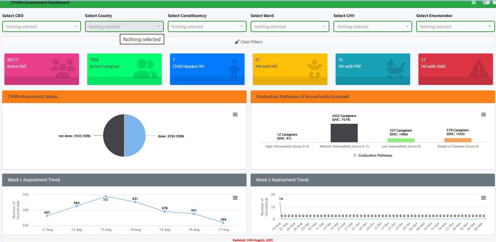
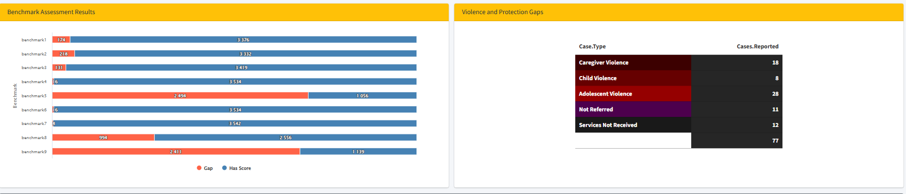

Over time, I have developed several interactive dashboards using **R (Shiny, bslib, tidyverse, ggplot2, and highcharter)** to support Monitoring, Evaluation, Accountability, and Learning (MEAL) functions.

These dashboards transform raw program data into interactive insights that support:\
- Real-time decision-making\
- Case management tracking\
- Data quality and performance monitoring\
- Operational reporting and learning

The sections below highlight selected dashboards, their purpose, the problem they solved, outcomes, and the tools used.

---

## 📊 OVC Program Dashboard

::: {.card}

**🔴 Live Dashboard**


```{=html}
<iframe 
  src="https://sufuri.shinyapps.io/ovc_gaps/"
  width="100%" 
  height="520px" 
  style="border:1px solid #ddd; border-radius:14px;">
</iframe>

```


**Problem Addressed**\
Data was fragmented across multiple Excel files, making it difficult to track beneficiaries, monitor case management progress, and identify service gaps in real time.

**Outcome Achieved**

⬆️ 65% improvement in real-time visibility of OVC caseload\
⬆️ 50% faster identification of vulnerable households requiring follow-up\
⬆️ Improved data-driven decision-making during monthly review meetings

:::
---

## 💼 Job Tracker Dashboard

::: {.card}

**🔴 Live Dashboard**

```{=html}
<iframe 
  src="https://sufuri.shinyapps.io/job_tracker/"
  width="100%" 
  height="600px" 
  style="border:1px solid #ddd; border-radius:14px;">
</iframe>
```

**Problem Addressed**\
I was not tracking my job applications at all. After applying for multiple roles, I had no structured way of knowing the status of each application or understanding how my applications were performing, especially since I rarely received feedback from employers.

**Outcome Achieved**

⬆️ 70% improvement in application tracking efficiency\
⬆️ 60% reduction in missed follow-ups\
⬆️ Clear visibility of my application pipeline from submission to outcome

:::

## 💼 Case Plan Readiness Achievement Tracker Dashboard

::: {.card}

### 📊 Dashboard Preview

::: {.grid}

::: {.g-col-12 .g-col-md-6}

{width=100%}

:::

::: {.g-col-12 .g-col-md-6}

{width=100%}

:::

:::

---

**Problem Addressed**  
The CPARA assessment data for OVC households was previously difficult to track and interpret in real time, making it challenging for teams to monitor progress, identify gaps, and follow up on case plan achievements effectively.

---

**Outcome Achieved**

⬆️ Improved real-time visibility of household assessment progress  
⬆️ Faster identification of gaps and protection risks  
⬆️ Enhanced data-driven decision-making for CPARA monitoring  

:::

