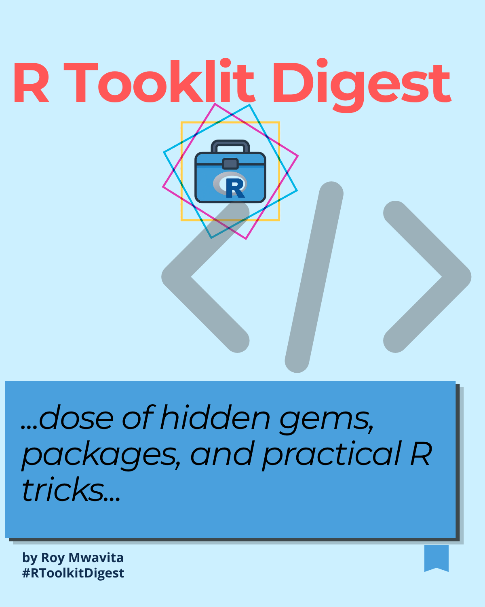

::: {.grid}

::: {.g-col-12 .g-col-md-6}

{width=100%}

:::

::: {.g-col-12 .g-col-md-6}

A collection of practical lessons learned while working with R for data analysis, visualization, and MEAL systems.  

Each issue breaks down real-world techniques used in reporting, dashboards, and data transformation workflows.

:::

:::

---

## 📚 Issues

::: {.grid}

::: {.g-col-12 .g-col-md-6}

::: {.card}

### 📊 Issue 1  
#### Small ggplot2 Tricks That Make Better Charts

**Topics Covered:**

- Grammar of Graphics  
- geom_col()  
- Fill aesthetics  
- position_dodge()  

A practical guide on improving the clarity and visual impact of bar charts in ggplot2.

```{=html}
<iframe 
  src="files/improving_group_charts.pdf"
  width="100%" 
  height="400px"
  style="border:1px solid #ddd; border-radius:12px;">
</iframe>
```

```{=html}
<a href="files/improving_group_charts.pdf" target="_blank">
  <button style="padding:8px 14px; border:none; border-radius:8px; background:#2c3e50; color:white; cursor:pointer;">
    📥 Download PDF
  </button>
</a>
```

:::
:::

::: {.g-col-12 .g-col-md-6}
::: {.card}

### 📊 Issue 2  
#### Understanding pivot_longer() and pivot_wider()

**Topics Covered:**

- Data reshaping in R\
- Wide vs long formats\
- tidyverse workflows\

A practical guide on transforming datasets for analysis and visualization.

```{=html}
<iframe 
  src="files/reshaping_survey_data.pdf"
  width="100%" 
  height="400px"
  style="border:1px solid #ddd; border-radius:12px;">
</iframe>
```

```{=html}
<a href="files/reshaping_survey_data.pdf" target="_blank">
  <button style="padding:8px 14px; border:none; border-radius:8px; background:#2c3e50; color:white; cursor:pointer;">
    📥 Download PDF
  </button>
</a>

```

:::

:::

::: {.g-col-12 .g-col-md-6}
::: {.card}

### 📊 Issue 3  
#### Factors and Ordering Categories in ggplot2

**Topics Covered:**

- Understanding factors in R\
- Setting and reordering factor levels\
- Controlling category order in ggplot2\
- Creating meaningful survey and Likert-scale visualizations

A practical guide to using factors to control how categorical data is displayed in tables, analyses, and ggplot2 visualizations.

```{=html}
<iframe 
  src="files/factors_and_ordering_categories.pdf"
  width="100%" 
  height="400px"
  style="border:1px solid #ddd; border-radius:12px;">
</iframe>
```

```{=html}
<a href="files/factors_and_ordering_categories.pdf" target="_blank">
  <button style="padding:8px 14px; border:none; border-radius:8px; background:#2c3e50; color:white; cursor:pointer;">
    📥 Download PDF
  </button>
</a>

```

:::

:::
::: {.g-col-12 .g-col-md-6}
::: {.card}

### 📊 Issue 4
#### Do More with Less Code in te Tidyverse

**Topics Covered:**

- Using across() to transform multiple columns at once\
- Using map() to automate repetitive data wrangling tasks\
- Using reduce() to combine multiple datasets efficiently\
- Writing cleaner, more scalable tidyverse workflows

A practical guide to reducing repetitive code in R by applying functions across columns, iterating over datasets, and combining multiple data sources using modern tidyverse tools.

```{=html}
<iframe 
  src="files/do_more_with_less.pdf"
  width="100%" 
  height="400px"
  style="border:1px solid #ddd; border-radius:12px;">
</iframe>
```

```{=html}
<a href="files/do_more_with_less.pdf" target="_blank">
  <button style="padding:8px 14px; border:none; border-radius:8px; background:#2c3e50; color:white; cursor:pointer;">
    📥 Download PDF
  </button>
</a>

```

:::

:::

:::


