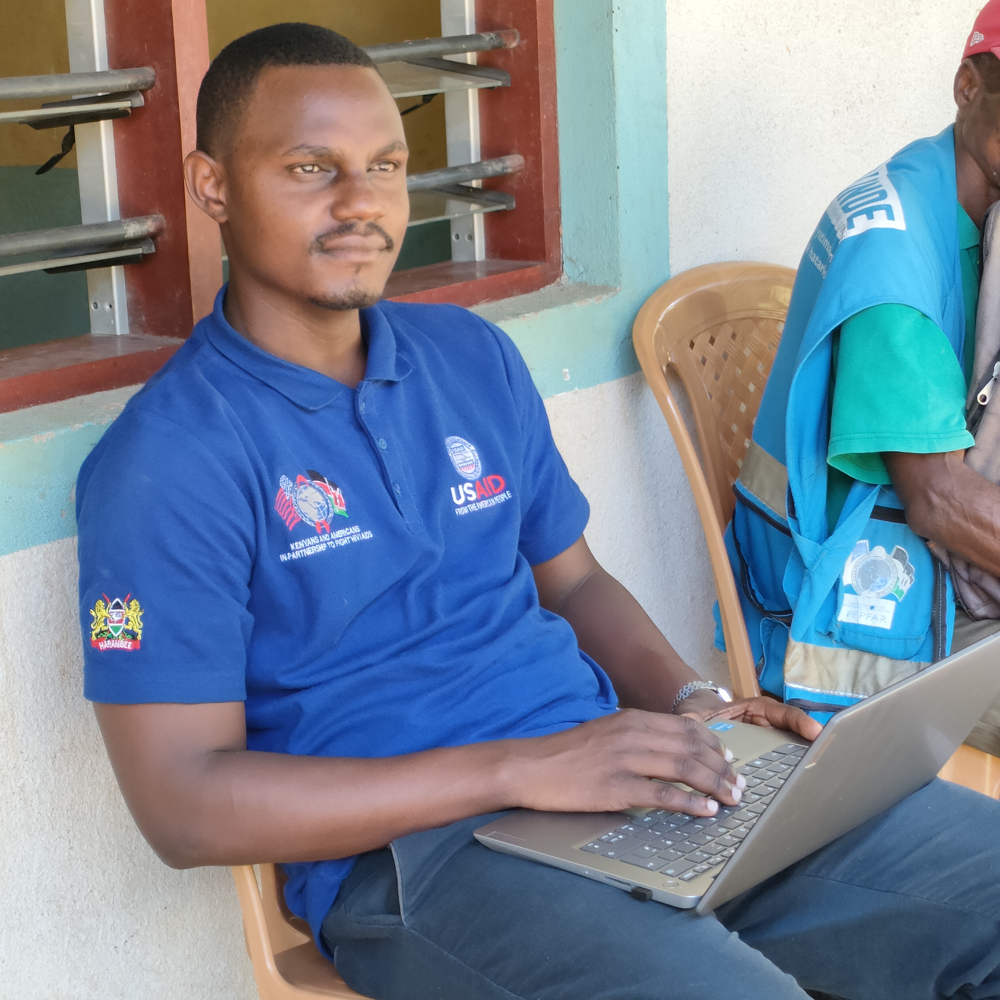

```{=html}
<!-- Add Font Awesome CDN for icons -->
<link rel="stylesheet" href="https://cdnjs.cloudflare.com/ajax/libs/font-awesome/6.4.2/css/all.min.css">

<style>
  /* Root Theme Configuration matching the topmate aesthetic */
  :root {
    --brand-orange: #d94d43;
    --text-light: #ffffff;
    --text-dark: #222222;
    --bg-cream: #f6f4ee;
    --card-shadow: 0 4px 15px rgba(0,0,0,0.05);
  }

  * {
    margin: 0;
    padding: 0;
    box-sizing: border-box;
  }

  body {
    font-family: system-ui, -apple-system, 'Segoe UI', Roboto, Helvetica, sans-serif;
    background: var(--bg-cream);
  }

  /* Core Layout splits 1/4 and 3/4 */
  .portfolio-container {
    display: grid;
    grid-template-columns: 1fr;
    min-height: 100vh;
  }

  @media (min-width: 992px) {
    .portfolio-container {
      grid-template-columns: 1.2fr 3.8fr;
    }
  }

  /* 1/4 Left Panel: Core Profile Branding Sidebar */
  .profile-sidebar {
    background-color: var(--brand-orange);
    color: var(--text-light);
    padding: 3rem 2rem;
    display: flex;
    flex-direction: column;
    align-items: center;
    text-align: center;
  }

  .avatar-frame {
    width: 160px;
    height: 160px;
    border-radius: 50%;
    overflow: hidden;
    margin-bottom: 1.5rem;
    border: 3px solid rgba(255, 255, 255, 0.4);
    box-shadow: 0 4px 10px rgba(0,0,0,0.15);
  }

  .avatar-frame img {
    width: 100%;
    height: 100%;
    object-fit: cover;
  }

  .profile-sidebar h1 {
    font-size: 2rem;
    font-weight: 700;
    margin-bottom: 0.5rem;
    color: var(--text-light);
    line-height: 1.2;
  }

  .profile-sidebar h4 {
    font-size: 1rem;
    font-weight: 400;
    opacity: 0.9;
    margin-bottom: 1.5rem;
    line-height: 1.4;
    border-bottom: 1px solid rgba(255,255,255,0.2);
    padding-bottom: 1.5rem;
    width: 100%;
  }

  /* Vertical Sidebar Social Links Block */
  .sidebar-socials {
    display: flex;
    gap: 1.5rem;
    margin-bottom: 2rem;
    font-size: 1.5rem;
  }

  .sidebar-socials a {
    color: var(--text-light);
    opacity: 0.85;
    transition: opacity 0.2s, transform 0.2s;
  }

  .sidebar-socials a:hover {
    opacity: 1;
    transform: scale(1.1);
  }

  /* 3/4 Right Panel: Main Dashboard Content Area */
  .content-showcase {
    background-color: var(--bg-cream);
    padding: 4rem 3rem;
  }

  @media (max-width: 768px) {
    .content-showcase {
      padding: 2rem 1.5rem;
    }
  }

  /* Horizontal Content-Top Navigation Menu */
  .sidebar-nav {
    display: flex;
    flex-wrap: wrap;
    gap: 0.75rem;
    margin-bottom: 2.5rem;
    padding-bottom: 1.5rem;
    border-bottom: 1px solid rgba(0, 0, 0, 0.08);
  }

  .sidebar-nav a {
    color: #555555;
    text-decoration: none;
    font-size: 14px;
    font-weight: 500;
    padding: 10px 20px;
    border-radius: 30px;
    background: #ffffff;
    box-shadow: 0 2px 8px rgba(0,0,0,0.02);
    border: 1px solid rgba(0, 0, 0, 0.05);
    transition: all 0.2s ease;
    display: inline-flex;
    align-items: center;
    gap: 0.5rem;
  }

  .sidebar-nav a:hover {
    color: var(--brand-orange);
    background: #ffffff;
    border-color: var(--brand-orange);
    transform: translateY(-1px);
  }

  .sidebar-nav a.active {
    color: #ffffff;
    background: var(--brand-orange);
    border-color: var(--brand-orange);
    font-weight: 600;
    box-shadow: 0 4px 12px rgba(217, 77, 67, 0.25);
  }

  .showcase-section-title {
    font-size: 1.5rem;
    font-weight: 700;
    color: var(--text-dark);
    margin-bottom: 1.5rem;
    position: relative;
  }

  /* Profile summary card */
  .profile-summary {
    background: #ffffff;
    border-radius: 16px;
    padding: 2rem;
    margin-bottom: 2.5rem;
    box-shadow: var(--card-shadow);
    border: 1px solid rgba(0,0,0,0.02);
  }

  .profile-summary .experience-text {
    color: #444;
    font-size: 1rem;
    line-height: 1.6;
    margin-bottom: 1rem;
  }

  .profile-summary .skills-preview {
    display: flex;
    flex-wrap: wrap;
    gap: 0.5rem;
  }

  .profile-summary .skill-tag {
    background: var(--bg-cream);
    color: #444;
    padding: 6px 14px;
    border-radius: 20px;
    font-size: 12px;
    font-weight: 500;
  }

  .profile-summary .skill-tag.highlight {
    background: var(--brand-orange);
    color: #ffffff;
  }

  /* Content Cards */
  .showcase-grid {
    display: grid;
    grid-template-columns: repeat(2, 1fr);
    gap: 2rem;
    margin-bottom: 3rem;
  }

  @media (max-width: 768px) {
    .showcase-grid {
      grid-template-columns: 1fr;
    }
  }

  .showcase-card {
    background: #ffffff;
    border-radius: 16px;
    padding: 2rem;
    box-shadow: var(--card-shadow);
    border: 1px solid rgba(0,0,0,0.02);
    transition: transform 0.25s ease, box-shadow 0.25s ease;
    display: flex;
    flex-direction: column;
    justify-content: space-between;
  }

  .showcase-card:hover {
    transform: translateY(-4px);
    box-shadow: 0 8px 25px rgba(0,0,0,0.08);
  }

  .showcase-card h3 {
    margin-top: 0;
    font-size: 1.3rem;
    color: var(--text-dark);
    margin-bottom: 0.75rem;
  }

  .showcase-card p {
    color: #666666;
    font-size: 14px;
    line-height: 1.6;
    margin-bottom: 1.5rem;
    flex-grow: 1;
  }

  .showcase-card .explore-link {
    color: var(--brand-orange);
    text-decoration: none;
    font-weight: 600;
    font-size: 14px;
    display: inline-flex;
    align-items: center;
    gap: 0.25rem;
    transition: gap 0.2s;
  }

  /* CV Card */
  .cv-card {
    background: #ffffff;
    border-radius: 16px;
    padding: 2rem;
    box-shadow: var(--card-shadow);
    display: flex;
    align-items: center;
    justify-content: space-between;
    flex-wrap: wrap;
    gap: 1.5rem;
    border: 1px solid rgba(0,0,0,0.02);
  }

  .cv-info h3 {
    margin: 0 0 0.25rem 0;
    font-size: 1.2rem;
    color: var(--text-dark);
  }

  .cv-info p {
    margin: 0;
    color: #666666;
    font-size: 14px;
  }

  .cv-btn {
    background: var(--brand-orange);
    color: #ffffff !important;
    text-decoration: none;
    padding: 10px 24px;
    border-radius: 8px;
    font-weight: 500;
    font-size: 14px;
    transition: background 0.2s, transform 0.2s;
    box-shadow: 0 4px 10px rgba(217, 77, 67, 0.2);
    display: inline-block;
  }
</style>
```


```{=html}
<div class="portfolio-container">
  <div class="profile-sidebar">
    <div class="avatar-frame">
      
    </div>
    
    <h1>Roy Mwavita</h1>
    <h4>Research Data Analyst • Monitoring & Evaluation Specialist</h4>

    <div class="sidebar-socials">
      <a href="https://github.com/roy-mwavita0" target="_blank"><i class="fab fa-github"></i></a>
      <a href="https://www.linkedin.com/in/roy-mwavita-495b50220/" target="_blank"><i class="fab fa-linkedin"></i></a>
      <a href="mailto:lennicroy@gmail.com"><i class="fas fa-envelope"></i></a>
    </div>
    
  </div>

  <div class="content-showcase">
    
    <nav class="sidebar-nav">
      <a href="index.qmd" class="active"><i class="fas fa-home"></i> Home</a>
      <a href="projects.qmd"><i class="fas fa-project-diagram"></i> Projects</a>
      <a href="dashboards.qmd"><i class="fas fa-chart-pie"></i> Dashboards</a>
      <a href="notes.qmd"><i class="fas fa-paper-plane"></i> Blog</a>
    </nav>

    <!-- Profile Summary - Moved to top -->
    <div class="profile-summary">
      <div class="experience-text">
        <strong>2+ years</strong> of experience turning program data into actionable insights for public health, research and development programs. Passionate about building data systems that drive impact in communities.
      </div>
      <div class="skills-preview">
        <span class="skill-tag highlight">R</span>
        <span class="skill-tag">R Shiny</span>
        <span class="skill-tag">Quarto</span>
        <span class="skill-tag">KoboToolbox</span>
        <span class="skill-tag">ODK</span>
        <span class="skill-tag">RedCap</span>
        <span class="skill-tag">Power BI</span>
        <span class="skill-tag">M&E Frameworks</span>
      </div>
    </div>

    <div class="showcase-section-title">Featured Areas</div>
    
    <div class="showcase-grid">
      <div class="showcase-card">
        <div>
          <h3>🧩 Projects</h3>
          <p>Data systems, automation tools, and analytics solutions developed for health and development programs.</p>
          
          <!-- Recent project preview -->
        </div>
        <a href="projects.qmd" class="explore-link">Explore →</a>
      </div>

      <div class="showcase-card">
        <div>
          <h3>✍️ Blog</h3>
          <p>Learning threads, tutorials, and reflections on data analytics, R programming, and MEAL workflows.</p>
          
          <!-- Recent blog preview -->
        </div>
        <a href="notes.qmd" class="explore-link">Explore →</a>
      </div>
    </div>

    <hr>

    <div class="cv-card">
      <div class="cv-info">
        <h3>📄 CV / Resume</h3>
        <p>Download my detailed CV for a complete overview of experience, certifications, and publications.</p>
      </div>
      <a href="files/CV_Roy%20Mwavita.pdf" class="cv-btn" target="_blank">
        <i class="fas fa-download"></i> Download CV
      </a>
    </div>
  </div>
  
  <hr>
<div style="text-align: center; padding: 2rem 0; color: #666; font-size: 13px;">
  <i class="fas fa-copyright"></i> 2026 Roy Mwavita | Built with <a href="https://quarto.org" style="color: #d94d43; text-decoration: none;">Quarto</a>
</div>
</div>
```