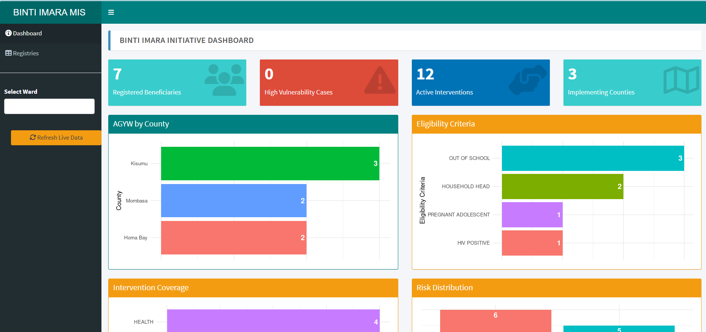
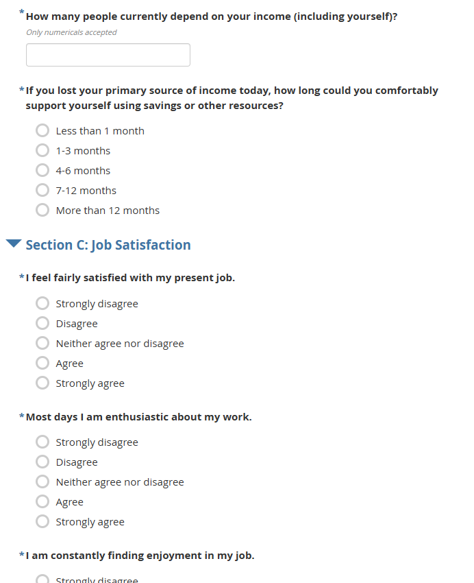
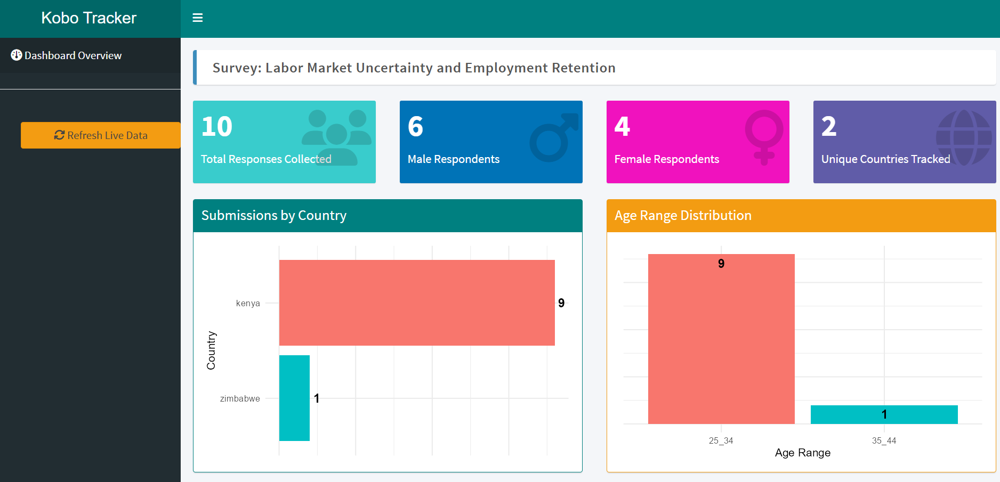
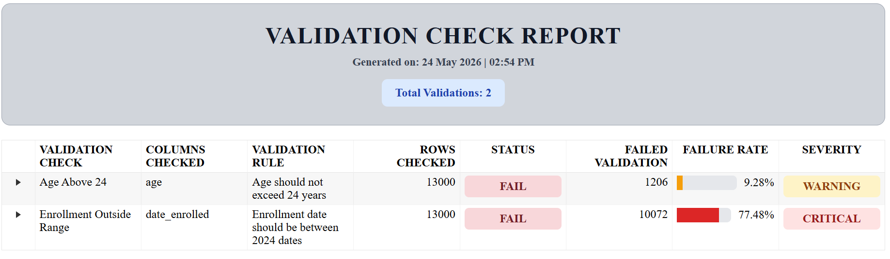
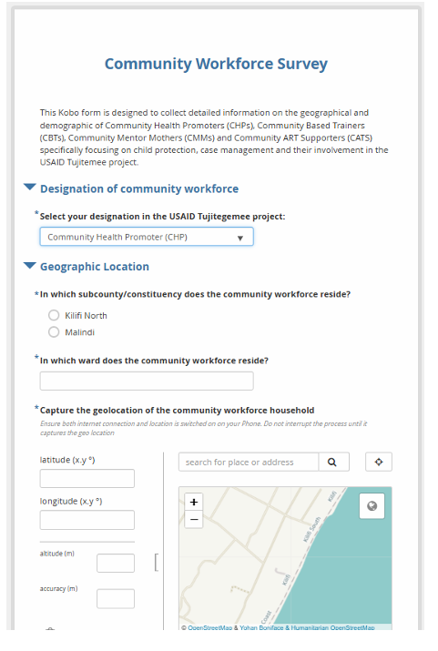
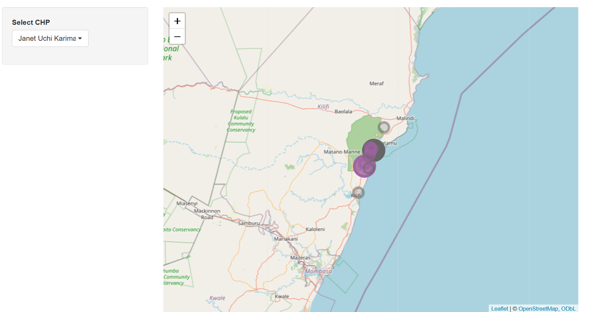

```{=html}
<style>
  /* Root Theme Configuration matching the topmate aesthetic */
  :root {
    --brand-orange: #d94d43;
    --text-light: #ffffff;
    --text-dark: #222222;
    --bg-cream: #f6f4ee;
    --card-shadow: 0 4px 15px rgba(0,0,0,0.05);
  }

  * {
    margin: 0;
    padding: 0;
    box-sizing: border-box;
  }

  body {
    font-family: system-ui, -apple-system, 'Segoe UI', Roboto, Helvetica, sans-serif;
    background: var(--bg-cream);
  }

  /* Core Layout splits 1/4 and 3/4 */
  .portfolio-container {
    display: grid;
    grid-template-columns: 1fr;
    min-height: 100vh;
  }

  @media (min-width: 992px) {
    .portfolio-container {
      grid-template-columns: 1.2fr 3.8fr;
    }
  }

  /* 1/4 Left Panel: Core Profile Branding Sidebar */
  .profile-sidebar {
    background-color: var(--brand-orange);
    color: var(--text-light);
    padding: 3rem 2rem;
    display: flex;
    flex-direction: column;
    align-items: center;
    text-align: center;
  }

  .avatar-frame {
    width: 160px;
    height: 160px;
    border-radius: 50%;
    overflow: hidden;
    margin-bottom: 1.5rem;
    border: 3px solid rgba(255, 255, 255, 0.4);
    box-shadow: 0 4px 10px rgba(0,0,0,0.15);
  }

  .avatar-frame img {
    width: 100%;
    height: 100%;
    object-fit: cover;
  }

  .profile-sidebar h1 {
    font-size: 2rem;
    font-weight: 700;
    margin-bottom: 0.5rem;
    color: var(--text-light);
    line-height: 1.2;
  }

  .profile-sidebar h4 {
    font-size: 1rem;
    font-weight: 400;
    opacity: 0.9;
    margin-bottom: 1.5rem;
    line-height: 1.4;
    border-bottom: 1px solid rgba(255,255,255,0.2);
    padding-bottom: 1.5rem;
    width: 100%;
  }

  /* Vertical Sidebar Social Links Block */
  .sidebar-socials {
    display: flex;
    gap: 1.5rem;
    margin-bottom: 2rem;
    font-size: 1.5rem;
  }

  .sidebar-socials a {
    color: var(--text-light);
    opacity: 0.85;
    transition: opacity 0.2s, transform 0.2s;
  }

  .sidebar-socials a:hover {
    opacity: 1;
    transform: scale(1.1);
  }

  /* 3/4 Right Panel: Main Dashboard Content Area */
  .content-showcase {
    background-color: var(--bg-cream);
    padding: 4rem 3rem;
  }

  @media (max-width: 768px) {
    .content-showcase {
      padding: 2rem 1.5rem;
    }
  }

  /* Horizontal Content-Top Navigation Menu */
  .sidebar-nav {
    display: flex;
    flex-wrap: wrap;
    gap: 0.75rem;
    margin-bottom: 2.5rem;
    padding-bottom: 1.5rem;
    border-bottom: 1px solid rgba(0, 0, 0, 0.08);
  }

  .sidebar-nav a {
    color: #555555;
    text-decoration: none;
    font-size: 14px;
    font-weight: 500;
    padding: 10px 20px;
    border-radius: 30px;
    background: #ffffff;
    box-shadow: 0 2px 8px rgba(0,0,0,0.02);
    border: 1px solid rgba(0, 0, 0, 0.05);
    transition: all 0.2s ease;
    display: inline-flex;
    align-items: center;
    gap: 0.5rem;
  }

  .sidebar-nav a:hover {
    color: var(--brand-orange);
    background: #ffffff;
    border-color: var(--brand-orange);
    transform: translateY(-1px);
  }

  .sidebar-nav a.active {
    color: #ffffff;
    background: var(--brand-orange);
    border-color: var(--brand-orange);
    font-weight: 600;
    box-shadow: 0 4px 12px rgba(217, 77, 67, 0.25);
  }

  .showcase-section-title {
    font-size: 1.5rem;
    font-weight: 700;
    color: var(--text-dark);
    margin-bottom: 1.5rem;
    position: relative;
  }

  /* Project Grid Styles for Single Row Alignment */
  .project-grid {
    display: grid;
    grid-template-columns: repeat(auto-fit, minmax(250px, 1fr));
    gap: 1.5rem;
    margin: 2rem 0;
  }

  @media (min-width: 1024px) {
    .project-grid {
      grid-template-columns: repeat(3, 1fr);
    }
  }

  .project-card {
    border: 1px solid #e0e0e0;
    border-radius: 12px;
    padding: 1.25rem;
    background: white;
    box-shadow: 0 2px 10px rgba(0,0,0,0.08);
    transition: transform 0.2s ease, box-shadow 0.2s ease;
    display: flex;
    flex-direction: column;
    justify-content: space-between;
  }

  .project-card:hover {
    transform: translateY(-5px);
    box-shadow: 0 4px 20px rgba(0,0,0,0.12);
  }

  .project-card h2 {
    margin-top: 0;
    margin-bottom: 0.75rem;
    font-size: 1.3rem; 
    line-height: 1.3;
    color: var(--text-dark);
  }

  .project-card p {
    color: #555;
    line-height: 1.5;
    margin-bottom: 1.25rem;
    font-size: 14px;
  }

  .project-card button {
    background: var(--brand-orange);
    color: white;
    border: none;
    padding: 10px 20px;
    border-radius: 6px;
    cursor: pointer;
    font-size: 14px;
    font-weight: 500;
    transition: background 0.2s ease, transform 0.2s ease;
    width: 100%;
    text-align: center;
  }

  .project-card button:hover {
    background: #bf3f36;
    transform: translateY(-1px);
  }

  /* Modal Styles */
  .modal {
    display: none;
    position: fixed;
    z-index: 9999;
    left: 0;
    top: 0;
    width: 100%;
    height: 100%;
    background-color: rgba(0,0,0,0.6);
    overflow: auto;
  }

  .modal-content {
    background-color: #fff;
    margin: 6% auto;
    padding: 2.5rem;
    border-radius: 16px;
    width: 85%;
    max-width: 750px;
    position: relative;
    box-shadow: 0 10px 40px rgba(0,0,0,0.2);
    animation: fadeIn 0.3s ease;
    color: var(--text-dark);
  }

  @keyframes fadeIn {
    from { opacity: 0; transform: translateY(-20px); }
    to { opacity: 1; transform: translateY(0); }
  }

  .close {
    position: absolute;
    right: 20px;
    top: 15px;
    font-size: 32px;
    font-weight: bold;
    cursor: pointer;
    color: #aaa;
    transition: color 0.2s ease;
    line-height: 1;
  }

  .close:hover {
    color: #000;
  }

  .modal-content h2 {
    margin-top: 0;
    margin-bottom: 1rem;
    padding-right: 30px;
    font-size: 1.6rem;
  }

  .modal-content h3 {
    color: var(--brand-orange);
    margin-top: 1.5rem;
    margin-bottom: 0.75rem;
    font-size: 1.2rem;
  }

  .modal-content p {
    line-height: 1.6;
    margin-bottom: 1rem;
    font-size: 15px;
    color: #444;
  }

  .modal-content ul {
    margin-bottom: 1.5rem;
    padding-left: 1.25rem;
  }

  .modal-content li {
    margin-bottom: 0.5rem;
    line-height: 1.5;
    font-size: 14px;
    color: #444;
  }

  .modal-content img {
    max-width: 100%;
    height: auto;
    border-radius: 12px;
    margin: 1rem 0;
    border: 1px solid #e0e0e0;
  }

  .modal-content a {
    color: var(--brand-orange);
    text-decoration: none;
    font-weight: 500;
  }

  .modal-content a:hover {
    text-decoration: underline;
  }

  hr {
    margin: 2rem 0;
    border: none;
    border-top: 1px solid rgba(0,0,0,0.1);
  }

  /* Responsive Mobile Breakpoint */
  @media (max-width: 768px) {
    .project-grid {
      grid-template-columns: 1fr;
      gap: 1.5rem;
    }
    
    .modal-content {
      margin: 15% auto;
      width: 92%;
      padding: 1.5rem;
    }
  }
</style>

<script>
  function openModal(modalId) {
    const modal = document.getElementById(modalId);
    if (modal) {
      modal.style.display = "block";
      document.body.style.overflow = "hidden";
    }
  }

  document.addEventListener('DOMContentLoaded', function() {
    window.closeModal = function(modalId) {
      const modal = document.getElementById(modalId);
      if (modal) {
        modal.style.display = "none";
        document.body.style.overflow = "auto";
      }
    }

    window.onclick = function(event) {
      const modals = document.querySelectorAll('.modal');
      modals.forEach(modal => {
        if (event.target === modal) {
          modal.style.display = "none";
          document.body.style.overflow = "auto";
        }
      });
    }

    document.addEventListener('keydown', function(event) {
      if (event.key === 'Escape') {
        const modals = document.querySelectorAll('.modal');
        modals.forEach(modal => {
          if (modal.style.display === 'block') {
            modal.style.display = "none";
            document.body.style.overflow = "auto";
          }
        });
      }
    });
  });
</script>

```


```{=html}
<div class="portfolio-container">
  <!-- Left Panel Sidebar Dynamic Fragment -->
  <div class="profile-sidebar">
    <div class="avatar-frame">
      
    </div>
    
    <h1>Roy Mwavita</h1>
    <h4>Research Data Analyst • Monitoring & Evaluation Specialist</h4>
    
    <div class="sidebar-socials">
      <a href="https://github.com/roy-mwavita0" target="_blank"><i class="fab fa-github"></i></a>
      <a href="https://www.linkedin.com/in/roy-mwavita-495b50220/" target="_blank"><i class="fab fa-linkedin"></i></a>
      <a href="mailto:lennicroy@gmail.com"><i class="fas fa-envelope"></i></a>
    </div>
  </div>

  <!-- Right Panel Content Showcase -->
  <div class="content-showcase">
    <!-- Navigation Menu Block -->
    <nav class="sidebar-nav">
      <a href="index.html"><i class="fas fa-home"></i> Home</a>
      <a href="projects.html" class="active"><i class="fas fa-project-diagram"></i> Projects</a>
      <a href="dashboards.html"><i class="fas fa-chart-pie"></i> Dashboards</a>
      <a href="digest.html"><i class="fas fa-book-open"></i> R Toolkit Digest</a>
      <a href="newsletter.html"><i class="fas fa-paper-plane"></i> Newsletter</a>
    </nav>

    <div class="showcase-section-title">My Projects</div>
    
    <!-- Projects Matrix Grid Area -->
    <div class="project-grid">
    
      <div class="project-card">
        <div>
          <h2>📈 Scalable M&E System for NGO Impact</h2>
          <p>
            An end-to-end digital Monitoring & Evaluation system built using
            KoBoToolbox, R, and Shiny to automate data collection, scoring,
            reporting, and real-time program monitoring for NGOs and CBOs.
          </p>
        </div>
        <button onclick="openModal('bintiImaraModal')">
          Read more →
        </button>
  </div>

      <div class="project-card">
        <div>
          <h2>📊 Labor Market Uncertainty & Employment Retention</h2>
          <p>
            An applied labor economics and behavioral data science case study 
            modeling the psychological and structural drivers behind "Job Hugging."
          </p>
        </div>
        <button onclick="openModal('jobHuggingModal')">
          Read more →
        </button>
      </div>

      <div class="project-card">
        <div>
          <h2>🛠️ validationcheck Package</h2>
          <p>
            An R package for automated data validation, quality assurance, and
            reporting in public health and research workflows.
          </p>
        </div>
        <button onclick="openModal('pkgModal')">
          Read more →
        </button>
      </div>

      <div class="project-card">
        <div>
          <h2>📌 Strengthening Community Health Promoter Systems through Geospatial Mapping</h2>
          <p>
            Geospatial analysis of Community Health Promoter coverage and household
            distribution using KoboToolbox, R, and Leaflet.
          </p>
        </div>
        <button onclick="openModal('chpModal')">
          Read more →
        </button>
      </div>

    </div>

    <!-- MODAL DETAILED WRAPPERS -->
    
      <!-- Modal 0: Binti Imara -->
  <div id="bintiImaraModal" class="modal">
    <div class="modal-content">
      <span class="close" onclick="closeModal('bintiImaraModal')">&times;</span>
  
      <h2>📈 Scalable M&E System for NGO Impact</h2>
  
      <p><strong>Project Type:</strong> Digital Monitoring & Evaluation System</p>
  
      <p><strong>Status:</strong> 🟢 Live Demonstration Project</p>
  
      <p><strong>Tools & Technologies:</strong>
        KoBoToolbox, KoBo API, R, robotoolbox, tidyverse, dplyr,
        Shiny, shinyapps.io, GitHub
      </p>
  
      <hr>
  
      <h3>🧠 Problem Statement</h3>
  
      <p>
        Small NGOs and community-based organizations often rely on
        disconnected spreadsheets, manual reporting processes,
        and limited technical infrastructure. These challenges
        result in delayed reporting, duplicate records,
        poor data quality, and limited visibility into program performance.
      </p>
  
      <hr>
  
      <h3>🎯 Solution</h3>
  
      <p>
        I designed and deployed an automated Monitoring &
        Evaluation ecosystem that connects data collection,
        storage, processing, analysis, and reporting into a
        single reproducible workflow.
      </p>
  
      <p>
        The system eliminates manual data downloads by pulling
        submissions directly from KoBoToolbox through its API,
        processing data in R, and displaying real-time insights
        through an interactive Shiny dashboard.
      </p>
  
      <hr>
  
      <h3>⚙️ System Architecture</h3>
  
      <ul>
        <li>📱 KoBoToolbox – Offline mobile data collection</li>
        <li>☁️ KoBo API – Automated data retrieval</li>
        <li>🧹 R + tidyverse – Data cleaning and transformation</li>
        <li>📊 Scoring Algorithms – Vulnerability assessment</li>
        <li>📈 Shiny Dashboard – Real-time monitoring</li>
        <li>🚀 shinyapps.io – Cloud deployment</li>
      </ul>
  
      <hr>
  
      <h3>🗂️ Data Collection System</h3>
  
      <p>
        The project uses three integrated KoBoToolbox forms:
      </p>
  
      <ul>
        <li>Registry Form – Beneficiary enrollment</li>
        <li>Screening Form – Vulnerability assessment</li>
        <li>Intervention Tracking Form – Service delivery monitoring</li>
      </ul>
  
      <p>
        Data entered through the forms is automatically synchronized
        and processed without requiring manual exports.
      </p>
  
      <hr>
  
      <h3>📊 Dashboard Outputs</h3>
  
      <ul>
        <li>Active beneficiaries</li>
        <li>Vulnerability scoring</li>
        <li>Intervention coverage</li>
        <li>High-risk case identification</li>
        <li>Real-time monitoring indicators</li>
        <li>Automated reporting summaries</li>
      </ul>
  
      
  
      <hr>
  
      <h3>🚀 Impact</h3>
  
      <ul>
        <li>Reduced reporting workload through automation</li>
        <li>Improved data quality using built-in validation</li>
        <li>Enabled real-time program monitoring</li>
        <li>Provided a low-cost M&E solution for NGOs and CBOs</li>
        <li>Demonstrated a scalable digital data ecosystem using open-source tools</li>
      </ul>
  
      <hr>
  
      <h3>🔗 Live Resources</h3>
  
      <p>
        <a href="https://roymwavita.shinyapps.io/dashboard_app//"
           target="_blank">
           📊 View Live Dashboard
        </a>
      </p>
  
      <p>
        <a href="https://rpubs.com/roy_mwavita/1442393"
           target="_blank">
           📄 View Full Project Portfolio
        </a>
      </p>
  
    </div>
  </div>
    
    <!-- Modal 1: Job Hugging -->
    <div id="jobHuggingModal" class="modal">
      <div class="modal-content">
        <span class="close" onclick="closeModal('jobHuggingModal')">&times;</span>
        <h2>📊 Labor Market Uncertainty and Employment Retention: "Job Hugging"</h2>
        <p><strong>Project Type:</strong> Applied Labor Economics & Behavioral Data Science Case Study</p>
        <p><strong>Status:</strong> 🟡 Data Collection & Modeling in Progress | 🟢 Infrastructure Complete</p>
        <p><strong>Tools & Technologies:</strong> R (tidyverse, psych, stats, ggplot2), R Shiny, KoboToolbox API, World Bank & ILOSTAT APIs</p>
        
        <hr>
        
        <h3>🗺️ Production Artifacts & Live System Architecture</h3>
        <p>
          This pipeline is engineered as an automated data product. The data collection layout and operational tracking system are deployed up front to handle streaming field entries cleanly without manual intervention.
        </p>
        
        <div style="display: grid; grid-template-columns: repeat(auto-fit, minmax(280px, 1fr)); gap: 1.5rem; margin: 1rem 0;">
          <div>
            <h4 style="color: var(--brand-orange); margin-top: 0; font-size:15px;">📋 Primary Data Collection Tool</h4>
            
            <p style="font-size: 13px; line-height: 1.4; margin-top:8px;"><em>Mobile-responsive tool engineered via KoboToolbox. Deploys tailored constraints and logic forks across sector paths (Tech, Retail, and NGOs) to secure structural integrity before collection. <a href="https://ee.kobotoolbox.org/x/VfVIo7wc/" target="_blank">Link to survey form</a></em></p>
          </div>
          <div>
            <h4 style="color: var(--brand-orange); margin-top: 0; font-size:15px;">🖥️ Live Survey Tracking Dashboard</h4>
            
            <p style="font-size: 13px; line-height: 1.4; margin-top:8px;">
              <em>
                Real-time monitoring system
                styled with the <code>fresh</code> theme engine. Features customized <code>ggplot2</code> visual frameworks and maps metrics dynamically via direct API callbacks.
                <a href="https://roymwavita.shinyapps.io/survey_tracker/" target="_blank">Link to dashboard</a> 
              </em>
            </p>
          </div>
        </div>
        
        <hr>
        
        <h3>🧠 Problem Statement</h3>
        <p>
          Modern labor markets are experiencing a structural paradox: while widespread workplace dissatisfaction remains documented, voluntary job mobility is declining across multiple core industries. This study investigates this emerging behavioral pattern—empirically operationalized as <strong>"Job Hugging"</strong>—where workers choose to remain in their current roles despite actively considering alternative employment, driven by compounding macroeconomic anxiety and asymmetric household financial constraints.
        </p>
        
        <hr>
        
        <h3>🧪 Methodology & Measurement Instruments</h3>
        <p>
          This quantitative cross-sectional behavioral study integrates validated primary psychometric measurement sub-scales with structural secondary macroeconomic indicators:
        </p>
        <ul>
          <li><strong>Job Satisfaction:</strong> Measured via the Brayfield-Rothe 5-item scale variables (<code>js1</code> to <code>js5</code>).</li>
          <li><strong>Job Insecurity:</strong> Tracked via the De Witte 4-item scale indicators (<code>ji1</code> to <code>ji4</code>).</li>
          <li><strong>Perceived Employability:</strong> Operationalized via the Rothwell & Arnold scale variables (<code>pe1</code> to <code>pe4</code>).</li>
          <li><strong>Financial Buffering:</strong> Modeled using numerical dependent ratios (<code>income_dependents</code>) and categorical timelines (<code>emergency_buffer</code>).</li>
        </ul>
        
        <hr>
        
        <h3>⚙️ Data Engineering & Econometric Framework</h3>
        <ul>
          <li><strong>Pipeline Automation:</strong> Configured programmatic API calls via <code>robotoolbox</code> to completely eliminate raw CSV exports, processing row binding algorithms live in workspace memory.</li>
          <li><strong>Psychometric Validation:</strong> Integrated scale verification via the <code>psych</code> library to compute Cronbach's alpha coefficients, enforcing a strict internal reliability threshold of alpha &ge; 0.70.</li>
          <li><strong>Model Specification:</strong> Implemented a <strong>Binary Logistic Regression Model</strong> estimating the log-odds probability of voluntary job mobility over a 12-month window against composite psychological scores and structural cross-country unemployment records.</li>
        </ul>
        
        <hr>
        
        <h3>🚀 Strategic Expected Impact</h3>
        <ul>
          <li>Empirically bridges macro-level labor marketplace constraints with micro-level worker sentiment realities.</li>
          <li>Enables human resource professionals and policy researchers to cleanly differentiate between positive retention and security-driven talent lock-in.</li>
          <li>Deploys an automated, production-ready pipeline architecture highlighting an end-to-end data product lifecycle.</li>
        </ul>
      </div>
    </div>

    <!-- Modal 2: Validation Package -->
    <div id="pkgModal" class="modal">
      <div class="modal-content">
        <span class="close" onclick="closeModal('pkgModal')">&times;</span>
        <h2>🛠️ validationcheck: Function-Based Data Validation Framework</h2>
        <p><strong>Project Type:</strong> R Package for Data Quality Validation</p>
        <p><strong>Status:</strong> In Development</p>
        <p><strong>Tools:</strong> R, tidyverse, dplyr, testthat, GitHub</p>
        
        <hr>
        
        <h3>🧠 Problem Statement</h3>
        <p>
          Data validation in real-world monitoring and evaluation workflows is often fragmented, with analysts writing repetitive scripts for missing values, duplicates, invalid ranges, and logical inconsistencies. Existing tools such as <strong>pointblank</strong> provide powerful validation pipelines, but they require structured setup that can slow down rapid analysis in field-based environments.
        </p>
        
        <hr>
        
        <h3>🎯 Solution</h3>
        <p>
          <code>validationcheck</code> introduces a function-based validation system that allows users to define and execute validation rules in a simple, readable pipeline while tracking summaries, failure rates, and severity classifications (GOOD, WARNING, CRITICAL).
        </p>
        
        <hr>
        
        <h3>⚙️ Core Function: add_validation()</h3>
        <pre style="background: #f4f4f4; padding: 1rem; border-radius: 8px; font-size: 13px; overflow-x: auto;">
add_validation(
  agent,
  label,
  columns,
  rule,
  preconditions = NULL,
  check
)
        </pre>
        
        <hr>
        
        <h3>📊 System Outputs</h3>
        <p><strong>Severity Rules:</strong><br>GOOD: 0% – 2% failure | WARNING: 2% – 20% failure | CRITICAL: > 20% failure</p>
        
        
        <hr>
        
        <p style="margin-top: 1.5rem;">
          <a href="https://github.com/roy-mwavita0/validationcheck" target="_blank">
            📦 View Package on GitHub →
          </a>
        </p>
      </div>
    </div>

    <!-- Modal 3: Geospatial Analysis -->
    <div id="chpModal" class="modal">
      <div class="modal-content">
        <span class="close" onclick="closeModal('chpModal')">&times;</span>
        <h2>📌 Strengthening Community Health Promoter Systems through Geospatial Mapping</h2>
        <p><strong>Organization:</strong> Council of Imams and Preachers of Kenya (CIPK) Taita Taveta Branch – USAID TUJITEGEMEE Project</p>
        <p><strong>Type:</strong> Community Health Systems Strengthening & Geospatial Analysis</p>
        <p><strong>Tools:</strong> R, Shiny, Leaflet, KoboToolbox, dplyr, Excel</p>
        
        <hr>
        
        <h3>🧠 Problem Statement</h3>
        <p>
          During an OVC household validation exercise, program teams identified challenges related to the geographical distribution of households supported by Community Health Promoters (CHPs). Some CHPs were supporting households located far from their areas of operation, while others experienced overlapping household assignments. These inefficiencies affected case management, follow-up visits, and service delivery.
        </p>
        
        <hr>
        
        <h3>🧪 Methodology</h3>
        <ul>
          <li>Designed and deployed a KoboToolbox survey to collect CHP geolocation data.</li>
          <li>Integrated household geolocation records collected during beneficiary validation exercises.</li>
          <li>Cleaned and processed data using R.</li>
          <li>Conducted geospatial analysis using Leaflet to map CHP and household locations.</li>
          <li>Identified overlapping coverage areas and household assignment gaps.</li>
          <li>Developed an interactive map to support evidence-based decision making.</li>
        </ul>
        
        <hr>
        
        <h3>🗺️ Project Workflow</h3>
        <div style="display: grid; grid-template-columns: repeat(auto-fit, minmax(280px, 1fr)); gap: 1.5rem; margin: 1rem 0;">
          <div>
            <h4 style="color: var(--brand-orange); font-size:15px; margin-bottom:8px;">Data Collection</h4>
            
            <p style="font-size:13px; margin-top:6px; color:#666;"><em>Geolocation survey developed in KoboToolbox and used to collect Community Health Promoter location data.</em></p>
          </div>
          <div>
            <h4 style="color: var(--brand-orange); font-size:15px; margin-bottom:8px;">Analytical Output</h4>
            
            <p style="font-size:13px; margin-top:6px; color:#666;"><em>Interactive map showing CHP and household distribution used to identify overlaps and service coverage gaps.</em></p>
          </div>
        </div>
        
        <hr>
        
        <h3>📊 Key Findings</h3>
        <ul>
          <li>Household assignments were not always aligned with the nearest CHP.</li>
          <li>Several households overlapped across CHP coverage areas.</li>
          <li>Significant variation existed in household distribution among CHPs.</li>
          <li>Distance between CHPs and households affected service delivery efficiency.</li>
        </ul>
        
        <hr>
        
        <h3>🚀 Outcome</h3>
        <ul>
          <li>Improved visibility of CHP household coverage areas.</li>
          <li>Supported evidence-based household realignment decisions.</li>
          <li>Strengthened planning and resource allocation for OVC case management.</li>
          <li>Demonstrated the value of geospatial analytics for community health programming.</li>
        </ul>
      </div>
    </div>

  </div>
  
  <hr>
<div style="text-align: center; padding: 2rem 0; color: #666; font-size: 13px;">
  <i class="fas fa-copyright"></i> 2026 Roy Mwavita | Built with <a href="https://quarto.org" style="color: #d94d43; text-decoration: none;">Quarto</a>
</div>
</div>
```